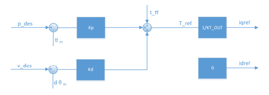
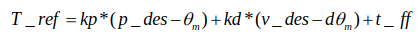

# Q&A

## 1. First-time Use: Gripper/Teach Pendant Cannot Be Controlled and No Feedback

Note: **This feature is not available in the V1 version interface**

> The gripper/teach pendant are end effectors, hereafter referred to as end effectors.

In the new version, the gripper needs to have its stroke range set at the factory. If this is not set, you will experience issues where the feedback value is always zero, and control is not possible.

The V2 version interface and above should be used to set this.

1. Execute [piper_disable.py](../demo/V2/piper_disable.py) to disable the robotic arm. Note that disabling the arm will cut power to all motors immediately.
2. Execute [V2_gripper_param_config.py](../demo/V2/V2_gripper_param_config.py) to set the stroke range for the end effector.
3. Then, execute [read_gripper_status.py](../demo/V2/read_gripper_status.py) to check if the end effector provides any feedback.
4. If you find that the stroke data for the end effector is too large when closed, you can use [piper_gripper_zero_set.py](../demo/V2/piper_gripper_zero_set.py) to set the end effector’s zero position

## 2. Jetson Orin Nano cannot detect official CAN module

For Jetpack 6.0 and above, you need to use the command line Jetpack and then compile the `gs_usb` module into the kernel during the kernel compilation phase.

Reference Links:<https://forums.developer.nvidia.com/t/missing-gs-usb-kernel-module-for-jetpack-6/275287/7>

You need to add `CONFIG_CAN_GS_USB=m`, etc., that is, refer to the `defconfig.jetpack_5_1_2.txt` file, add what is missing in `defconfig.jetpack_6_0.txt`, complete the `gs_usb` module related to CAN, and then recompile the kernel.

## 3. Answers to questions regarding torque parameters in MIT and how to obtain motor torque

### 3.1 Torque control in MIT



The MIT (Mixed-Input, Mixed-Input) mode enables hybrid control of torque, position, and velocity. In the diagram above, the position loop and velocity loop are connected in parallel. The output values ​​of the position and velocity loops are added to the feedforward torque `t_ff` to obtain the reference torque `T_ref`.



Where:

- `T_ref` is the reference torque, in `N·m`.
- `kp` is the position gain.
- `kd` is the velocity gain.
- `p_des` is the desired position of the motor output shaft, in `rad`.
- `θ_m` is the current position of the motor output shaft, in `rad`.
- `v_des` is the desired velocity of the motor output shaft, in `rad/s`.
- `dθ_m` is the current velocity of the motor output shaft, in `rad/s`.

**Note: When you send a target torque, the actual torque the motor executes is 4 times the input value. For example, if you send 1N, the motor executes 4N.**

### 3.2 SDK to obtain motor feedback torque

In the SDK, you can use `GetArmHighSpdInfoMsgs().motor_1.effort` to get the torque of `motor_1`, and then you need to scale it down by a factor of 1000 to get the torque in Nm. The 'x' in `motor_x` represents the nth joint.

However, note that for Piper's underlying firmware versions `1.8-2` and earlier, the feedback torque requires the following handling.

- J1-3 = GetArmHighSpdInfoMsgs().motor_x.effort / 4
- J4-6 = GetArmHighSpdInfoMsgs().motor_x.effort

## 4. How to use the Piper SDK on a Mac to control a robotic arm or read messages from it?

Version 0.6.0 and above added support for serial port CAN. A demo is shown below.

Note that before running the demo, you need to grant read and write permissions to the serial port. The command in Ubuntu is:

```bash
sudo chmod 777 /dev/ttyACM0
```

Note that if `can_auto_init` in the interface is `False`, you need to execute `CreateCanBus` to initialize the internal `__arm_can` before executing `ConnectPort`; otherwise, an error will occur.

If using a PCIe-to-CAN or serial CAN module, you need to set `judge_flag` to `False`; otherwise, it will detect the `socketcan` module under the Linux system.

The normal frame rate is around 3040 (connecting a single arm).

```python
#!/usr/bin/env python3
# -*-coding:utf8-*-
# Read the CAN ID frame rate related to the robotic arm
import time
from piper_sdk import *

# 测试代码
if __name__ == "__main__":
    piper = C_PiperInterface_V2(can_auto_init=False)
    piper.CreateCanBus(can_name="/dev/ttyACM0",
                       bustype="slcan",
                       expected_bitrate=1000000,
                       judge_flag=False
                       )
    piper.ConnectPort(piper_init=False)
    while(True):
        print(f"all_fps: {piper.GetCanFps()}")
        time.sleep(0.01)
```
