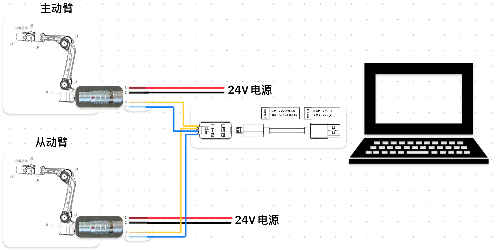
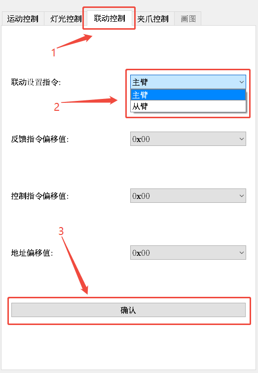

# Use two arm to remote control

## 1 Hardware connection

- Schematic diagram



1. Set one of the robot arms as the active arm and the other as the slave arm. There are two ways to set it: use the host computer or use the SDK
   1. Use the host computer:
    
   2. Use the sdk:

    ```python
    # Set the robot arm as the master arm
    from piper_sdk import *
    C_PiperInterface(can_name='can0', judge_flag=True).MasterSlaveConfig(0xFA, 0, 0, 0)
    ```

    ```python
    # Set the robot arm as a slave arm
    from piper_sdk import *
    C_PiperInterface(can_name='can0', judge_flag=True).MasterSlaveConfig(0xFC, 0, 0, 0)
    ```

2. Connect the two robotic arms to a CAN module, and connect the CANs of the master and slave arms.
3. Power on the slave arm first, then the master arm, wait a few seconds, and then you can perform remote control.
4. If it fails, check whether the CAN line is connected properly, and try to power it off and on again.

## 2 Read the master-slave data

- Master-slave arm control principle:

  The master arm sends control instructions with canid 0x155, 0x156, 0x157, 0x159, and 0x151, sets the slave arm to joint control mode and high follow mode, and the slave arm receives the mode control instructions and target joint angles sent by the master arm and moves.

See the interface description in the SDK for details.

[Interface_V1 README](./V1/INTERFACE_V1.MD) <br> [Interface_V2 README](./V2/INTERFACE_V2.MD)

Here is just a brief description

### 2.1 Reading Master Arm Messages

The message reporting of the master and slave arms has the following characteristics:

● Master arm: only sends control frame messages, canid 0x155, 0x156, 0x157, 0x159, 0x151.

● Slave arm: all feedback messages except control messages.

The functions `GetArmJointMsgs` and `GetArmGripperMsgs` are used to obtain the joint feedback message and gripper feedback message sent by the slave robot. The joint unit is 0.001 degrees and the gripper distance unit is µm.

The functions `GetArmJointCtrl` and `GetArmGripperCtrl` are used to obtain the joint control message and gripper control message sent by the active robot arm. The joint unit is 0.001 degree and the gripper distance unit is µm.

### 2.2 Control slave arm

Pay attention to the slave arm mode here. If you switch from the master-slave arm control mode to the position speed control mode, the robot arm needs to be reset before controlling it; if you still use the high follow mode when controlling the slave arm, you need to set the is_mit_mode parameter of MotionCtrl_2 to 0xAD.

`MotionCtrl_2` is used to set the control command mode, taking joint mode as an example.

● Set the robot position speed control mode + joint mode and enable

```python
piper = C_PiperInterface()
piper.ConnectPort()
# reset arm
piper.MotionCtrl_1(0x02,0,0)
# 0x01 Set the can command control mode
# 0x01 Set the joint control mode to Joint control
# 50 Set the robot arm movement speed ratio
piper.MotionCtrl_2(0x01, 0x01, 50)
piper.EnableArm()
# Later call joint control and gripper control
# ...
```

● Set the robot arm to high following mode

```python
piper = C_PiperInterface()
piper.ConnectPort()
# 0x01 sets the can command control mode
# 0x01 sets the joint control mode to Joint control
# The speed ratio is invalid in high follow mode
# 0xAD sets the robot arm to high follow mode
piper.MotionCtrl_2(0x01, 0x01, 100, 0xAD)
piper.EnableArm()
# Later call joint control and gripper control
# ...
```

`JointCtrl` is used to control six joints. The robot arm needs to be set to joint control mode in advance for this to take effect.

Note that the unit is 0.001 degrees. For example, if you want to control joint 2 to move to 5 degrees and other joints to move to 0 degrees.

```python
joint_1 = joint_3 = joint_4 = joint_5 = joint_6
joint_2 = int(round(5.0 * 1000))
piper.JointCtrl(joint_1, joint_2, joint_3, joint_4, joint_5, joint_6)
```

`GripperCtrl` is used to control the gripper.

For example, set the gripper torque to 1N/m and enable the gripper, then control the gripper to a position of 0.05m.

```python
range = int(0.05 * 1e6)
piper.GripperCtrl(abs(range), 1000, 0x01, 0)
```

Note!!!: **When controlling the slave arm, the master arm and the slave arm need to be disconnected. You can unplug the master arm's aviation plug and then run the slave arm control program. Otherwise, even if the program is executed, the slave arm will be out of control because the master arm is always sending slave arm control commands**
